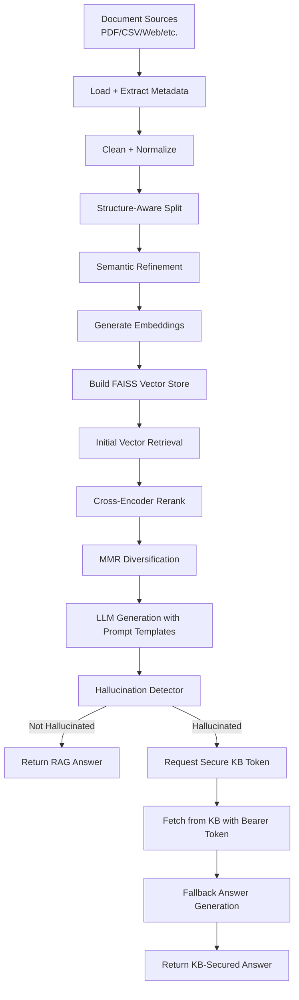

# Enterprise-Grade RAG System for Banking Knowledge Intelligence

An enterprise-focused, secure, and explainable Retrieval-Augmented Generation (RAG) system for banking knowledge workflows.  
The system combines document ingestion, advanced retrieval (vector search + reranking + MMR), hallucination detection, and a secure Knowledge Base (KB) fallback exposed through FastAPI endpoints.

## Key Features

- Multi-stage RAG pipeline: ingestion -> cleaning -> chunking -> embedding -> FAISS indexing -> retrieval -> generation.
- Advanced retrieval strategy:
  - Similarity search over FAISS
  - Cross-encoder reranking (`cross-encoder/ms-marco-MiniLM-L-6-v2`)
  - MMR-based diversification for balanced relevance and coverage
- Structure-aware + semantic chunking:
  - Recursive structural splitting
  - Sentence-level semantic refinement with configurable similarity threshold
  - Parallel chunk processing for multiple documents
- Hallucination guardrail using semantic similarity between answer and retrieved context.
- Secure KB fallback:
  - Internal API-key protected token endpoint
  - Short-lived bearer token validation for KB fetch access
  - Semantic query matching against curated banking KB entries
- API-first design with production-style routes for querying, debug, health checks, logs, and evaluation.
- Config-driven behavior via `config/settings.yaml` (documents, chunking, retrieval, generation, KB thresholds).
- Observability support through structured logging and retrieval log inspection endpoints.

## RAG Pipeline Workflow



## Technical Architecture

### 1) Ingestion and Preprocessing
- `src/ingestion/loaders.py`: loads source documents.
- `src/ingestion/extractor.py`: extracts text + metadata.
- `src/preprocessing/clean_normalize.py`:
  - document-type aware cleaning (web/csv/general text)
  - normalization of line breaks, whitespace, and paragraph formatting
- `src/preprocessing/chunking.py`:
  - structure-aware splitting (`RecursiveCharacterTextSplitter`)
  - semantic refinement using sentence-transformers + cosine similarity
  - parallel execution for improved throughput

### 2) Embeddings and Vector Store
- `src/embedding/embedder.py`: `HuggingFaceEmbeddings` wrapper.
  - Default embedding model: `BAAI/bge-base-en-v1.5`
  - CPU embedding with normalized vectors
- `src/vectorstore/faiss_store.py`:
  - Converts chunks to LangChain `Document`
  - Builds FAISS index via `FAISS.from_documents(...)`

### 3) Retrieval and Ranking
- `src/retrieval/retriever.py`:
  - Computes dynamic retrieval sizes (`initial_pct`, `rerank_pct`, `mmr_pct`)
  - Runs vector search, reranking, and MMR in sequence
- `src/retrieval/reranker.py`:
  - Cross-encoder relevance scoring for stronger ranking quality

### 4) Generation and Guardrails
- `src/rag/pipeline.py`:
  - Orchestrates end-to-end answer flow
  - Uses prompt templates from `src/rag/prompts.py`
  - Calls LLM via `langchain_groq` (`ChatGroq`)
- `src/guardrails/hallucination.py`:
  - Similarity-based hallucination detection against retrieved context
  - Returns `is_hallucinated` + `similarity_score`

### 5) Secure KB Fallback
- `src/api/routes_kb.py`:
  - `/kb/token` requires internal API key (`X-API-KEY`)
  - `/kb/fetch` requires short-lived bearer token
- `src/security/token_manager.py`:
  - In-memory UUID token issue + expiry validation
- `src/kb/kb_service.py` + `src/kb/kb_store.py`:
  - Semantic KB retrieval with configurable threshold and top-k

### 6) API Layer and Debugging
- `src/api/app.py`: FastAPI app entrypoint and router registration.
- `src/api/routes_query.py`: main `/query` endpoint with lazy-initialized, cached pipeline.
- `src/api/routes_debug.py`:
  - `/query/debug` for retrieval + hallucination inspection
  - `/health` service health status
  - `/retrieval/logs` log search endpoint
  - `/chunks/inspect` sample chunk inspection
  - `/evaluate` batch query evaluation

## Configuration (`config/settings.yaml`)

Main configurable blocks:

- `documents`: document paths and enable/disable flags.
- `chunking.similarity_threshold`: semantic split sensitivity.
- `retrieval`:
  - `initial_pct`
  - `rerank_pct`
  - `mmr_pct`
  - `lambda_mult`
  - `min_chunk`
- `generation`:
  - `llm_model`
  - `temperature`
  - `max_output_tokens`
- `KB`:
  - `kb_api_url`
  - `similarity_threshold`
  - `top_k_relevant`

## API Endpoints

- `GET /` -> service status message
- `POST /query` -> primary RAG response
- `POST /query/debug` -> debug-level retrieval + hallucination info
- `GET /health` -> health check
- `GET /retrieval/logs` -> retrieval observability logs
- `GET /chunks/inspect` -> chunk inspection helper
- `POST /evaluate` -> batch evaluation over test queries
- `POST /kb/token` -> secure token generation (internal key required)
- `POST /kb/fetch` -> secure KB fetch (bearer token required)

## Tech Stack

- **Language:** Python
- **Framework/API:** FastAPI, Uvicorn
- **RAG Orchestration:** LangChain ecosystem
- **LLM Access:** Groq (`langchain_groq`)
- **Embeddings:** HuggingFace (`BAAI/bge-base-en-v1.5`)
- **Vector Index:** FAISS (`faiss-cpu`)
- **Reranking & Similarity:** `sentence-transformers`, `scikit-learn`
- **Document Parsing/Cleaning:** `pypdf`, `beautifulsoup4`
- **Configuration/Env:** YAML config + `.env`

## Installation

```bash
pip install -r requirements.txt
```

## Run the API

```bash
uvicorn src.api.app:app --reload --host 127.0.0.1 --port 8000
```

## Quick Local Test

Use the included script:

```bash
python test.py
```

## Environment Variables

Set these in `.env` (or system environment):

- `INTERNAL_API_KEY` (used by secure KB token route)
- `TOKEN_EXPIRY_SECONDS` (KB token lifetime; route default is 60 if unset)
- `GROQ_API_KEY` (required to run the Groq-backed LLM model in the RAG pipeline)

Example `.env`:

```env
GROQ_API_KEY=your_groq_api_key_here
INTERNAL_API_KEY=your_internal_api_key_here
TOKEN_EXPIRY_SECONDS=60
```
